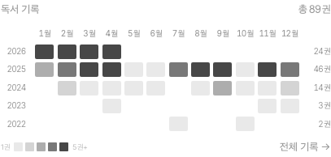
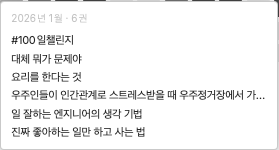

# writing.sungd.uk

> 읽은 것들을, 생각을, 만들면서 알게 된 것을 글로 씁니다.

개인 블로그입니다. 책을 읽고, 세상을 겪고, 머릿속을 정리한 것을 글로 남깁니다. 글쓰기는 생각의 근육을 키우는 연습이자, 나를 돌아보는 시간입니다.

## Preview

|                        홈                         |                          포스트                          |
| :-----------------------------------------------: | :------------------------------------------------------: |
|  |  |

### 히트맵

독서 기록과 글쓰기 활동을 시각화합니다. 셀에 마우스를 올리면 해당 월에 읽은 책 목록이 표시됩니다.

## Writing

| 카테고리 | 설명                            |
| -------- | ------------------------------- |
| 책       | 서평과 독서 노트                |
| 생각     | 개인 에세이와 사유              |
| 기술     | 개발·도구 기록 (tech에서 옮겨옴) |
