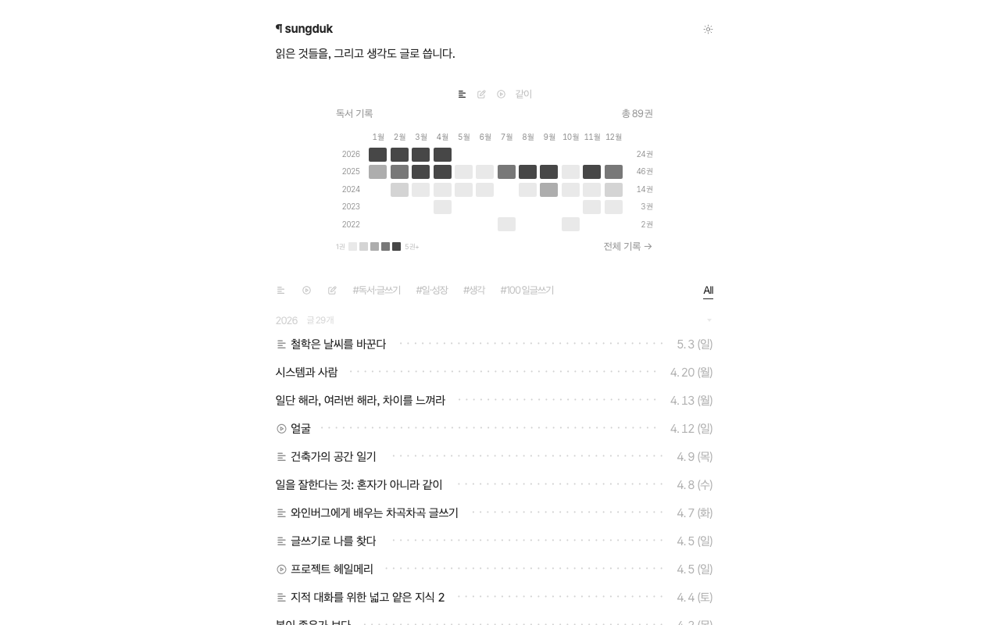
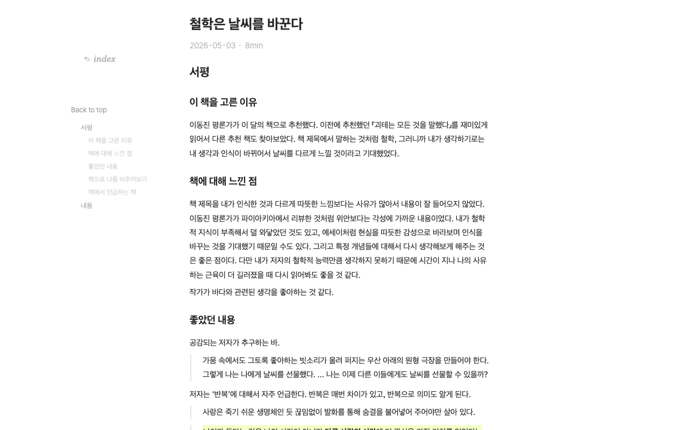

# sungd.uk

> 읽은 것들을, 그리고 생각도 글로 씁니다.

개인 블로그입니다. 책을 읽고, 세상을 겪고, 머릿속을 정리한 것을 글로 남깁니다. 글쓰기는 생각의 근육을 키우는 연습이자, 나를 돌아보는 시간입니다.

## Preview

### 홈

### 포스트

## Writing

| 카테고리 | 설명 |
|---------|------|
| 책 | 서평과 독서 노트 |
| 생각 | 개인 에세이와 사유 |
| 개발 | 소프트웨어 엔지니어링 이야기 |
| 100일글쓰기챌린지 | 매일 글쓰기 연습 기록 |
